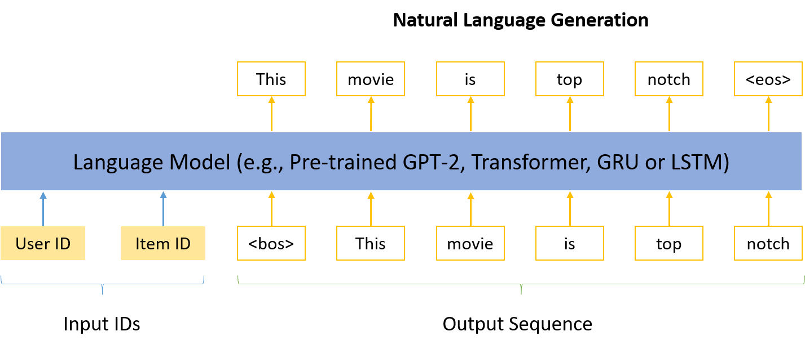

# NLG4RS \[[详细介绍](https://zhuanlan.zhihu.com/p/452571871)\]

This is a small ecosystem created for **Recommender Systems-based Natural Language Generation**. It consists of implementation of typical language models (including pre-trained model GPT-2, Transformer, GRU and LSTM), evaluation metrics, public datasets and the way to create these datasets. It is instantiated on recommendation explanation generation, but could be easily extended to other applications of personalized natural language generation, such as review generation, tip generation, review summarization, dialogue systems, etc.

## Problem formulation
Given a pair of user ID and item ID, the language model needs to generate a word sequence, as shown below. In the case of recommendation explanation generation, the model is instructed to explain why the item is recommended to the user. Extra data, e.g., knowledge graph, could be incorporated.



## Implementation of typical models

Click the links below to find the code (with PyTorch 1.6) and the paper.

- [PEPLER](https://github.com/lileipisces/PEPLER) \cite{TOIS23-PEPLER}: pre-trained model GPT-2
- [PETER](https://github.com/lileipisces/PETER) \cite{ACL21-PETER}: Transformer
- [NRT](https://github.com/lileipisces/NRT) \cite{SIGIR17-NRT}: GRU
- [Att2Seq](https://github.com/lileipisces/Att2Seq) \cite{EACL17-Att2Seq}: LSTM

## Evaluation metrics

Besides BLEU in machine translation and ROUGE in text summarization, four explainability metrics \cite{CIKM20-NETE, WWW20-NETE}, which particularly care about item features and sentence diversity, are included in the implementation.

- Unique Sentence Ratio (USR)
- Feature Matching Ratio (FMR)
- Feature Coverage Ratio (FCR)
- Feature Diversity (DIV)

## [Public datasets](https://lifehkbueduhk-my.sharepoint.com/:f:/g/personal/16484134_life_hkbu_edu_hk/Eln600lqZdVBslRwNcAJL5cBarq6Mt8WzDKpkq1YCqQjfQ?e=cISb1C) and how to create them

Each record in the datasets below \cite{CIKM20-NETE, WWW20-NETE} is comprised of a user ID, an item ID, a rating, an explanation, and a feature. The explanations are high-quality sentences extracted from user reviews, via [Sentires-Guide](https://github.com/lileipisces/Sentires-Guide) \cite{CIKM20-NETE, WWW20-NETE} that could obtain ```(feature, opinion, sentence, sentiment)``` quadruples from reviews. It is a Python wrapper for the Java tool [Sentires](https://github.com/evison/Sentires) \cite{SIGIR14-Sentires}, which can infer ```(feature, opinion, sentiment)``` triples from reviews.

- TripAdvisor Hong Kong
- Amazon Movies & TV
- Yelp 2019

## Citations
```
@article{TOIS23-PEPLER,
	title={Personalized Prompt Learning for Explainable Recommendation},
	author={Li, Lei and Zhang, Yongfeng and Chen, Li},
	journal={ACM Transactions on Information Systems (TOIS)},
	year={2023}
}
@inproceedings{ACL21-PETER,
	title={Personalized Transformer for Explainable Recommendation},
	author={Li, Lei and Zhang, Yongfeng and Chen, Li},
	booktitle={ACL},
	year={2021}
}
@inproceedings{SIGIR17-NRT,
	title={Neural rating regression with abstractive tips generation for recommendation},
	author={Li, Piji and Wang, Zihao and Ren, Zhaochun and Bing, Lidong and Lam, Wai},
	booktitle={SIGIR},
	year={2017}
}
@inproceedings{EACL17-Att2Seq,
	title={Learning to generate product reviews from attributes},
	author={Dong, Li and Huang, Shaohan and Wei, Furu and Lapata, Mirella and Zhou, Ming and Xu, Ke},
	booktitle={EACL},
	year={2017}
}
@inproceedings{CIKM20-NETE,
	title={Generate Neural Template Explanations for Recommendation},
	author={Li, Lei and Zhang, Yongfeng and Chen, Li},
	booktitle={CIKM},
	year={2020}
}
@inproceedings{WWW20-NETE,
	title={Towards Controllable Explanation Generation for Recommender Systems via Neural Template},
	author={Li, Lei and Chen, Li and Zhang, Yongfeng},
	booktitle={WWW Demo},
	year={2020}
}
@inproceedings{SIGIR14-Sentires,
	title={Do users rate or review? Boost phrase-level sentiment labeling with review-level sentiment classification},
	author={Zhang, Yongfeng and Zhang, Haochen and Zhang, Min and Liu, Yiqun and Ma, Shaoping},
	booktitle={SIGIR},
	year={2014}
}
```
